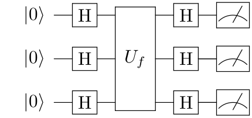

# חישוב קוונטי בפועל

ידע תיאורטי על חישוב קוונטי הוא טוב ויפה, אבל האם קיימת דרך לבצע חישוב קוונטי כיום בפועל, בסיוע המחשב הביתי שלנו? התשובה חיובית, אם כי התחום עדיין בראשית דרכו. ננסה להבין כאן מה ניתן לעשות וכיצד.

ראשית, מחשבים קוונטיים כיום הם מוצרים מורכבים ביותר שדורשים תנאי אחזקה מיוחדים ואנשי תחזוקה ייעודיים; בעתיד הנראה לעין לא נראה שמחשבים קוונטיים יהפכו למוצרים ביתיים. לכן האופן הנפוץ בימינו לגישה למחשב קוונטי הוא באמצעות **שירות ענן** כלשהו: המחשב הקוונטי הפיזי נמצא
בידי חברה כל שהיא, והיא מאפשרת למשתמשים לשלוח לו פקודות דרך האינטרנט ושולחת בחזרה את התשובה. זה תהליך שלא מאפשר שליטה מלאה על המחשב, אבל בהחלט מאפשר ביצוע של חישוב ברמה שאותה ראינו, של הפעלת מעגלים קוונטיים.

שנית, גישה למחשבים קוונטיים היא על פי רוב משאב מוגבל, כי מספרם של המחשבים הפעילים אינו גדול.
לכן, בשלב שבו מפתחים מעגל קוונטי כלשהו ורוצים לבדוק אותו, הדבר הנוח לעשות הוא להריץ אותו תחילה על **סימולטור**:
תוכנית מחשב שרצה על מחשב רגיל ומדמה את החישוב שאותו מבצע המחשב הקוונטי
(לפעמים עד לרמה שבה ניתן להוסיף "רעשים" כדי לדמות חישוב ריאליסטי.

אנחנו נציג כאן ספריית Qiskit של חברת IBM, שעונה על הצרכים הללו. בעזרת Qiskit ניתן:
1. ליצור מעגלים קוונטיים בעזרת שפת Python.
2. להריץ את המעגלים הקוונטיים על מחשבים קוונטיים אמיתיים (בכפוף לרישום לאתר של IBM, מה שניתן לביצוע ללא תשלום).
3. להריץ את המעגלים הקוונטיים על ידי סימולטור (הן על המחשב של המשתמש גם ללא רישום, והן על המחשבים של IBM בכפוף לרישום).
4. שלל יכולות נוספות.

בהמשך ההסבר נניח ידע בשפת Python; גם ללא ידע כזה ניתן להבין את רוב ההמשך כי לא נתבסס על תכונות מורכבות במיוחד של השפה.

הדרך הנוחה ביותר להתרגל לעבודה עם חבילת תוכנה היא לעשות איתה משימה קונקרטית; אנחנו נפתור תרגיל שבו מממשים את אלגוריתם דויטש-ג'וזה.
# כיצד משתמשים ב-Qiskit?

יש שתי דרכים עיקריות שניתן להשתמש בהן על מנת ליצור מעגלים קוונטיים ולהריץ אותם דרך המערכת של IBM:

1. שימוש בכלי ה-[Composer](https://quantum-computing.ibm.com/composer) של IBM אשר מאפשר בניית מעגלים באמצעות ממשק גרפי.
2. שימוש בשפת התכנות Python בשילוב עם חבילת התוכנה qiskit.

בעוד שהגישה הראשונה מועילה להתנסויות ובדיקות מהירות, הגישה השניה, לאחר שמתרגלים אליה, מאפשרת עבודה מורכבת ונוחה יותר.

לא נציג כאן לעומק את העבודה עם Python ו-qiskit אלא נסתפק במעט הנדרש על מנת לפתור את התרגיל.

לאחר התקנת Python, כדי להתקין את החבילות להן נזדקק ניתן להשתמש בפקודה

```python
pip install qiskit qiskit-aer
```

זה יתקין את החבילה הראשית (qiskit) ואת החבילה שכוללת את הסימולטור הקוונטי שבו נשתמש (qiskit-aer).

במקום תוכנית “Hello World” סטנדרטית נכתוב תוכנית שבונה מעגל לייצור מצב שזור ומדידה שלו, ואז מריצה עליו סימולטור, ומדפיסה את המעגל ואת תוצאות הרצת הסימולטור:

```python
from qiskit import QuantumCircuit
from qiskit_aer import Aer

circuit = QuantumCircuit(2)
circuit.h(0)
circuit.cx(0,1)
circuit.measure_all()

simulator = Aer.get_backend('aer_simulator')

counts = simulator.run(circuit).result().get_counts()

print(circuit)
print(counts)
```

הרצת התוכנית תניב פלט הדומה לזה:

```python
        ┌───┐      ░ ┌─┐   
   q_0: ┤ H ├──■───░─┤M├───
        └───┘┌─┴─┐ ░ └╥┘┌─┐
   q_1: ─────┤ X ├─░──╫─┤M├
             └───┘ ░  ║ └╥┘
meas: 2/══════════════╩══╩═
                      0  1
{'11': 515, '00': 509}
```

המספרים שבפלט הם 515 ו-509 המסתכמים ל-1024 מכיוון שהפונקציה `run` שבה הסימולטור משתמש מריצה את המעגל 1024 פעמים כברירת מחדל וסופרת תוצאות (ניתן לשלוט על מספר הפעמים עם הפרמטר `shots` שמועבר לפקודה `run` אך לא יהיה בכך צורך בתרגיל).

נראה דוגמא נוספת, שבה משתמשים בלולאה כדי להוסיף חלק מהשערים. כאן אנו בונים מעגל שמחשב את הפונקציה שהופכת את הקיוביטים השני, הרביעי והחמישי (שימו לב שהאינדקסים של הקיוביטים מתחילים ב-0) ומחברת (מודולו 2) לקיוביט השביעי את ששת הקיוביטים הראשונים.

```python
from qiskit import QuantumCircuit
from qiskit_aer import Aer

circuit = QuantumCircuit(7)
circuit.x(1)
circuit.x(3)
circuit.x(4)
for qubit in range(6):
    circuit.cx(qubit,6)
circuit.measure_all()

simulator = Aer.get_backend('aer_simulator')

counts = simulator.run(circuit).result().get_counts()

print(circuit)
print(counts)
```

הפלט של המעגל הזה הוא דטרמיניסטי:

```jsx
                                            ░ ┌─┐
   q_0: ───────■────────────────────────────░─┤M├──────────────────
        ┌───┐  │                            ░ └╥┘┌─┐
   q_1: ┤ X ├──┼────■───────────────────────░──╫─┤M├───────────────
        └───┘  │    │                       ░  ║ └╥┘┌─┐
   q_2: ───────┼────┼────■──────────────────░──╫──╫─┤M├────────────
        ┌───┐  │    │    │                  ░  ║  ║ └╥┘┌─┐
   q_3: ┤ X ├──┼────┼────┼────■─────────────░──╫──╫──╫─┤M├─────────
        ├───┤  │    │    │    │             ░  ║  ║  ║ └╥┘┌─┐
   q_4: ┤ X ├──┼────┼────┼────┼────■────────░──╫──╫──╫──╫─┤M├──────
        └───┘  │    │    │    │    │        ░  ║  ║  ║  ║ └╥┘┌─┐
   q_5: ───────┼────┼────┼────┼────┼────■───░──╫──╫──╫──╫──╫─┤M├───
             ┌─┴─┐┌─┴─┐┌─┴─┐┌─┴─┐┌─┴─┐┌─┴─┐ ░  ║  ║  ║  ║  ║ └╥┘┌─┐
   q_6: ─────┤ X ├┤ X ├┤ X ├┤ X ├┤ X ├┤ X ├─░──╫──╫──╫──╫──╫──╫─┤M├
             └───┘└───┘└───┘└───┘└───┘└───┘ ░  ║  ║  ║  ║  ║  ║ └╥┘
meas: 7/═══════════════════════════════════════╩══╩══╩══╩══╩══╩══╩═
                                               0  1  2  3  4  5  6
{'1011010': 1024}
```

שימו לב בפרט לכך שמחרוזת הפלט `1011010` היא בסדר ********הפוך******** ממה שאולי היה ניתן לצפות: ערכו של קיוביט 0 הוא הימני ביותר, וערכו של קיוביט 6 הוא השמאלי ביותר. זה האופן שבו מתקבל הפלט ב-Qiskit.

# מה המשימה שיש לבצע?

מטרת התרגיל היא לממש את הפונקציות החסרות בקובץ `[dj.py](dj.py)` שקיבלתם:

```python
from qiskit import QuantumCircuit
import random

def generate_const_oracle(n):
    """
    Returns a circuit computing a constant function

    Parameters
    ----------
    n: The number of of input qubits for the oracle

    Returns
    -------
    A `QuantumCircuit` on `n+1` qubits, 
    computing the function f(x_1,...,x_n, y) = (x_1,...,x_n, y+b)
    where b is a random bit
    """

def generate_balanced_oracle(b_str):
    """
    Returns a circuit computing a balanced function

    Parameters
    ----------
    b_str : A string describing the balanced oracle

    Returns
    -------
    A `QuantumCircuit` on `n+1` qubits, where the length of b_str is `n`, 
    computing the function f(x_1,...,x_n, y) = (x_1,...,x_n, y+(-1)^a_1*x_1+...+(-1)^a_n*x_n)
    where a_1,...,a_n are the bits given in b_str

    Note: This function assums b_str is correct 
    (i.e. a string of the characters '0' and '1', not all '0')
    """

def generate_dj_circuit(n, oracle):
    """
    Returns a circuit for the Deutsch–Jozsa algorithm for n qubits
    for the given oracle

    Parameters
    ----------
    n: The number of of input qubits for the oracle
    oracle: An oracle computing a function f(x_1,...,x_n, y) which can be
    either constant or balanced.

    Note: f is represented using a quantum circuit on `n+1` qubits; the last qubit is
    used for the output.

    Returns
    -------
    A `QuantumCircuit` on `n+1` qubits, implementing the Deutsch–Jozsa algorithm.
    When running the circuit on a quantum computer, the expected results are either
    '00...0' if the oracle is constant, or different if it is balanced
    """
    
def dj_algorithm(n, oracle, backend):
    """
    Runs the Deutsch–Jozsa algorithm on the given oracle
    for the given oracle

    Parameters
    ----------
    n: The number of of input qubits for the oracle
    oracle: An oracle computing a function f(x_1,...,x_n, y) which is guaranteed
    to be either constant or balanced
    backend: The quantum backend (simulator/quantum computer) to run the algorithm on

    Returns
    -------
    The string "CONSTANT" if the oracle represents a constant function,
    and "BALANCED" if it represents a balanced function
    """

def bv_algorithm(n, oracle, backend):
    """
    Runs the Bernstein–Vazirani algorithm on the given oracle

    Parameters
    ----------
    n: The number of of input qubits for the oracle
    oracle: An oracle computing a function f which is guaranteed to be
    of the form f(x_1,...,x_n, y) = (x_1,...,x_n,  y+a_1x_1+...+a_nx_n)
    backend: The quantum backend (simulator/quantum computer) to run the algorithm on

    
    Returns
    -------
    A list on integers [a_1, a_2,...,a_n] corresponding to the function f
    computer by the oracle
    """
```

הסבר לגבי מה שהפונקציות אמורות לעשות:

הפונקציה `generate_const_oracle` אמורה להחזיר **********************מעגל קוונטי********************** שמייצג פונקציה קבועה כפי שתוארה בקובץ המבוא המתמטי: דהיינו, פלטי המעגל זהים לקלטים למעט עבור הקלט האחרון, שלערכו מתווסף ערך קבוע כלשהו שאינו תלוי בערכי הקלט (הערך הקבוע נתון לבחירתכם ויכול להיבחר באקראי).

הפונקציה `generate_balanced_oracle` אמורה להחזיר **********************מעגל קוונטי********************** שמייצג פונקציה מאוזנת שמתוארת על ידי המחרוזת `b_str`. אם אברי `b_str` הם סדרת הערכים הבינאריים `a_1, a_2, ..., a_n` אז הפונקציה אמורה להיות `f(x_1,...,x_n, y) = (x_1,...,x_n, y+(a_1+x_1)+...+(a_n+x_n))` (כדאי לבדוק מדוע היא פונקציה מאוזנת).

הפונקציה `generate_dj_circuit` אמורה לקבל מעגל קוונטי שמייצג אורקל, ואת מספר הקיוביטים שלו **************לא כולל************** קיוביט העזר, ולהוציא כפלט מעגל אשר מממש את אלגוריתם דויטש-ג’וזה בהתאם למבנה



 הפונקציה `dj_algorithm` אמורה להריץ את אלגוריתם דויטש-ג’וזה. היא מקבלת אורקל, את מספר הקיוביטים שלו **************לא כולל************** קיוביט העזר, ואת ה-`backend` שמטרתו להריץ את המעגל בפועל, ומטרתה להחזיר את המחרוזת `"CONSTANT"` במקרה שהאורקל מייצג פונקציה קבועה, או את המחרוזת `"BALANCED"` אם האורקל מייצג פונקציה מאוזנת.

שימו לב לכך ש-`backend` עשוי להיות גם סימולטור וגם מחשב קוונטי אמיתי; אם תרצו להריץ על מחשב קוונטי אמיתי עיינו בהסברים שבסוף מסמך זה; אם האלגוריתם שלכם יעבוד עבור סימולטור זה טוב דיו.

הפונקציה `bv_algorithm` אמורה להריץ את אלגוריתם ברנשטיין-וזירני. . היא מקבלת אורקל, את מספר הקיוביטים שלו **************לא כולל************** קיוביט העזר, ואת ה-`backend` שמטרתו להריץ את המעגל בפועל, ומטרתה להחזיר רשימה `[a_1, a_2, ... , a_n]` של ביטים כך שהאורקל מממש את הפונקציה

 `f(x_1,...,x_n, y) = (x_1,...,x_n, y+a_1*x_1+...+a_n*x_n)`

# כיצד בודקים את נכונות הקוד שלכם?

לנוחותכם, צירפנו תוכנית שמבצעת בדיקה אוטומטית לנכונות הקוד שלכם. נסביר כאן כיצד היא פועלת.

```python
import unittest
import random
from qiskit_aer import Aer
from qiskit.quantum_info import CNOTDihedral
from qiskit.circuit.library.generalized_gates import LinearFunction
import dj

class TestOracles(unittest.TestCase):
    def test_const_oracle(self):
        for n in range(1,5):
            circ = dj.generate_const_oracle(n)
            func = CNOTDihedral(circ).linear[n][:n]
            self.assertTrue(all(x == 0 for x in func))

    def test_balanced_oracle(self):
        for n in range(1,5):
            bitstring = "".join(random.choices(['0', '1'], k=n))
            circ = dj.generate_balanced_oracle(bitstring)
            func = CNOTDihedral(circ).linear[n][:n]
            self.assertFalse(all(x == 0 for x in func), msg=f"Failure on bitstring {bitstring}")

class TestAlgorithm(unittest.TestCase):
    def test_dj(self):
        simulator = Aer.get_backend('aer_simulator')
        for n in range(1,5):
            # Constant oracle
            oracle = dj.generate_const_oracle(n)
            result = dj.dj_algorithm(n, oracle, simulator)
            self.assertEqual(result, "CONSTANT")

            # Balanced oracle
            bitstring = "".join(random.choices(['0', '1'], k=n))
            oracle = dj.generate_balanced_oracle(bitstring)
            result = dj.dj_algorithm(n, oracle, simulator)
            self.assertEqual(result, "BALANCED")

    def test_bv(self):
        simulator = Aer.get_backend('aer_simulator')
        a = [1,0,0,0,1,1,0,1]
        n = len(a)
        matrix = [[row == col for col in range(n+1)] for row in range(n+1)]
        for col in range(n):
            matrix[n][col] = (a[col] == 1)

        circ = LinearFunction(matrix).synthesize()
        result = dj.bv_algorithm(n, circ, simulator)
        self.assertEqual(result, a)

if __name__ == '__main__':
    unittest.main()
```

התוכנית מתבססת על ספריית `unittest` הסטנדרטית של פייתון. השורות

```jsx
if __name__ == '__main__':
    unittest.main()
```

בסוף הקוד משמעותן שאם הקובץ מורץ כמות שהוא, הבדיקות של `unittest` מופעלות. הפלט הצפוי מהרצה שכזו, בהנחה שמימשתם את כל הקוד שלכם בצורה תקינה, הוא

```jsx
....
----------------------------------------------------------------------
Ran 4 tests in 0.058s

OK
```

כאן ארבע הנקודות שבשורה הראשונה מייצגות את ארבעת המבחנים שהספרייה `unittest` הריצה. מבחן שנכשל מופיע לא בתור נקודה אלא בתור E (אם התקבלה שגיאה) או F (אם אחת מהבדיקות שבמסגרת המבחן נכשלה).

הקוד עצמו מחולק ל************מחלקות************. כל מחלקה מייצגת אוסף של מבחנים סביב נושא מסויים (בשימושים מתקדמים יותר מחלקה עשויה לכלול גם פונקציות עזר, פונקציות לאתחול וסיום שמופעלות בתחילת וסוף כל מבחן, וכדומה). בכל מחלקה הפונקציות ששמן מתחיל ב-test הן מבחנים שיופעלו אוטומטית על ידי `unittest`.

כך מופיע בתחילת הקוד:

```jsx
class TestOracles(unittest.TestCase):
    def test_const_oracle(self):
        for n in range(1,11):
            circ = dj.generate_const_oracle(n)
            func = CNOTDihedral(circ).linear[n][:n]
            self.assertTrue(all(x == 0 for x in func))
```

קוד זה מגדיר את המחלקה `TestOracles` שמיועדת לבדיקת המימוש של פונקציות ייצור האורקלים. הפונקציה `test_const_oracle` בודקת שהאורקל עבור פונקציה קבועה יוצר בצורה תקינה.

הקוד עצמו עובר על מספרי הקיוביטים מ-1 עד 10 (הפונקציה `range(a,b)` של פייתון מחזירה את כל המספרים מ-a עד b לא כולל b עצמו). לאחר מכן הקוד קורא לפונקציה שאותה עליכם לממש שמייצרת מעגל עבור האורקל, ולאחר מכן נעשה שימוש באחד מהכלים המתקדמים של Qiskit שממיר את המעגל לייצוג של הפונקציה שהוא מתאר (זה עובד רק עבור מעגלים עם מבנה מסויים מאוד; המעגל שאותו תבנו עלול להפיל את המבחן בשלב הזה, אבל פירוש הדבר הוא שקיים מימוש פשוט בהרבה מזה שבחרתם בו). לבסוף מתבצעת בדיקה שהפונקציה המחושבת היא אכן קבועה.

אין צורך להבין את הבדיקה המתבצעת בסיום, אבל הנה הסבר למקרה הצורך: הפונקציה שאותה האורקל אמור לחשב היא

`f(x_1,…,x_n, y) = (x_1,…, x_n, y+b)`

כך ש-b קבוע. בכתיב וקטורי, אפשר לחשוב על הפונקציה בתור f(x)=x+B כך ש-B וקטור (שכולו אפסים למעט הכניסה האחרונה שהיא 0). פונקציה כזו מכונה ********************פונקציה אפינית********************. היא מורכבת מפונקציה לינארית, f(x)=x, ועוד קבוע B.

בעזרת המחלקה `CNOTDihedral` המעגל של האורקל מומר לייצוג בתור פונקציה אפינית, והחלק של `linear[n][:n]` בקוד אומר “תנו לי את החלק הלינארי של הפונקציה האפינית, כשהוא מיוצג בתור מטריצה; תנו לי את השורה האחרונה במטריצה; תנו לי את כל העמודות פרט לאחרונה בשורה הזו”. מכיוון שהפונקציה הלינארית אמורה להיות הזהות, המטריצה אמורה להיות מטריצת היחידה, ולכן כל הכניסות פרט לאחרונה אמורות להיות 0; זו הבדיקה שמתבצעת בפועל בשורה הבאה.

```jsx
def test_balanced_oracle(self):
        for n in range(1,11):
            bitstring = "".join(random.choices(['0', '1'], k=n))
            circ = dj.generate_balanced_oracle(bitstring)
            func = CNOTDihedral(circ).linear[n][:n]
            self.assertFalse(all(x == 0 for x in func), msg=f"Failure on bitstring {bitstring}")
```

קטע הקוד הזה שבודק את יצירת האורקל לפונקציה מאוזנת עובד באותו האופן. הבדיקה בשורה האחרונה מוודאת שהפונקציה הנוצרת היא לינארית שאינה קבועה; פונקציה כזו בהכרח תהיה מאוזנת (פונקציות לא מאוזנות לא יהיו לינאריות ולכן כבר שלב יצירת ה-`CNOTDihedral` בשורה הקודמת ייכשל).

```jsx
class TestAlgorithm(unittest.TestCase):
    def test_dj(self):
        simulator = Aer.get_backend('aer_simulator')
        for n in range(1,11):
            # Constant oracle
            oracle = dj.generate_const_oracle(n)
            result = dj.dj_algorithm(n, oracle, simulator)
            self.assertEqual(result, "CONSTANT")

            # Balanced oracle
            bitstring = "".join(random.choices(['0', '1'], k=n))
            oracle = dj.generate_balanced_oracle(bitstring)
            result = dj.dj_algorithm(n, oracle, simulator)
            self.assertEqual(result, "BALANCED")
```

קטע הקוד הזה מתחיל את בדיקת האלגוריתמים (דויטש-ג’וזה וברנשטיין-וזירני). הבדיקה הראשונה מייצרת אורקלים קבועים/מאוזנים, מעבירה אותם לפונקציה שמממשת את דויטש-ג’וזה ובודקת שהתקבל הפלט הצפוי.

```jsx
def test_bv(self):
        simulator = Aer.get_backend('aer_simulator')
        a = [1,0,0,0,1,1,0,1]
        n = len(a)
        matrix = [[row == col for col in range(n+1)] for row in range(n+1)]
        for col in range(n):
            matrix[n][col] = (a[col] == 1)

        circ = LinearFunction(matrix).synthesize()
        result = dj.bv_algorithm(n, circ, simulator)
        self.assertEqual(result, a)
```

הבדיקה עבור ברנשטיין-וזירני מסובכת מעט יותר. ראשית הפונקציה בונה מטריצה ספציפית שמתארת את הפונקציה הלינארית f(x)=a*x (כאשר כאן * מתאר מכפלה סקלרית מעל Z_2) עבור הוקטור a הספציפי שמוגדר בקוד; אחר כך נעשה שימוש במחלקה `LinearFunction` של Qiskit כדי לבנות מעגל אשר מממש אותה, ולבסוף מורץ האלגוריתם של ברנשטיין-וזירני על המעגל הזה מתוך ציפייה לקבל חזרה את הוקטור a.

# כיצד מריצים מעגלים על מחשב קוונטי אמיתי?

ניתן להירשם בחינם לשירות [IBM Quantum](https://quantum-computing.ibm.com/) שמאפשר גישה למחשבים קוונטיים וממשק גרפי עבור בניית מעגלים (שלא נשתמש בו כאן).

לאחר הרשמה וכניסה ללוח הבקרה, ניתן להעתיק את ה-API Token שלכם:


ניתן לעשות עם ה-Token אחד משניים: להעביר אותו במפורש בכל הרצה שבה ניגשים למחשבים הקוונטיים של IBM, או לשמור אותו על המחשב ולאפשר לקוד לגשת אליו אוטומטית. כדי לשמור את ה-Token על המחשב הריצו את קטע הקוד הבא:

```python
from qiskit import IBMQ
IBMQ.save_account(token="<MY TOKEN>")
```

כמובן, תוך החלפת `<MY TOKEN>` בערכו האמיתי של ה-Token שקיבלתם.

כעת, על מנת לגשת למחשב קוונטי של IBM ניתן לבצע את הדבר הבא:

```python
from qiskit import QuantumCircuit, IBMQ, transpile
from qiskit.providers.ibmq import least_busy

IBMQ.load_account()
provider = IBMQ.get_provider(hub='ibm-q', group='open', project='main')
backend = least_busy(provider.backends(simulator=False, min_num_qubits=5))
```

קוד זה מתחבר לשרת, משיג `provider` שהוא רכיב התוכנה שנותן גישה לאחד מהמחשבים הקוונטיים, ובקוד הנוכחי משמש לקבלת גישה למחשב קוונטי `backend` שהוא הפנוי ביותר כרגע (קיימות דרכים אחרות לגשת למחשבים, למשל ישירות על פי שם המחשב המבוקש).

אם ה-Token לא נשמר על המחשב, ההבדל היחיד הוא בשורות

```python
IBMQ.load_account()
provider = IBMQ.get_provider(hub='ibm-q', group='open', project='main')
```

שמוחלפת ב-

```python
provider = IBMQ.enable_account(token="<MY TOKEN>", hub='ibm-q', group='open', project='main')
```

לאחר מכן ניתן להשתמש ב-`backend` על מנת להריץ מעגלים בדיוק כפי שזה בוצע עם הסימולטור, למעט הבדל אחד אבל קריטי: בניגוד לסימולטור, המחשבים הקוונטיים מסוגלים להתמודד רק עם מעגלים שבנויים מסט ספציפי של שערים ועם מגבלות על זוגות הקיוביטים שניתן לבצע עליהם פעולת CX. על מנת להפוך את האספקט הזה לשקוף למשתמש, ניתן לבצע פעולה שנקראת ********************טרנספילציה******************** שממירה את המעגל הקוונטי של המשתמש במעגל קוונטי שקול שניתן להריץ על מחשב ספציפי (בדומה לפעולת קומפליציה).

מכיוון שלמחשבים שונים דרישות שונות, פקודת הטרנספילציה מקבלת כקלט גם את המעגלים שרוצים להריץ, וגם את ה-`backend` שעליו מתכוונים להריץ.

נמחיש זאת עם קובץ הדוגמא שאיתו התחלנו, בגרסה שניתן להריץ על מחשב קוונטי:

```python
from qiskit import QuantumCircuit, IBMQ, transpile
from qiskit.providers.ibmq import least_busy

circuit = QuantumCircuit(2)
circuit.h(0)
circuit.cx(0,1)
circuit.measure_all()

IBMQ.load_account()
provider = IBMQ.get_provider(hub='ibm-q', group='open', project='main')
backend = least_busy(provider.backends(simulator=False, min_num_qubits=5))

circuit = transpile(circuit, backend)
counts = backend.run(circuit).result().get_counts()

print(circuit)
print(counts)
```

תוצאת הרצה זו היא

```python
global phase: π/4
               ┌─────────┐┌────┐┌─────────┐      ░ ┌─┐
      q_0 -> 0 ┤ Rz(π/2) ├┤ √X ├┤ Rz(π/2) ├──■───░─┤M├───
               └─────────┘└────┘└─────────┘┌─┴─┐ ░ └╥┘┌─┐
      q_1 -> 1 ────────────────────────────┤ X ├─░──╫─┤M├
                                           └───┘ ░  ║ └╥┘
ancilla_0 -> 2 ─────────────────────────────────────╫──╫─
                                                    ║  ║
ancilla_1 -> 3 ─────────────────────────────────────╫──╫─
                                                    ║  ║
ancilla_2 -> 4 ─────────────────────────────────────╫──╫─
                                                    ║  ║
       meas: 2/═════════════════════════════════════╩══╩═
                                                    0  1
{'00': 1895, '01': 83, '10': 94, '11': 1928}
```

כפי שניתן לראות, המעגל השתנה בצורה מוזרה, ובנוסף לכך תוצאות המדידה הן שונות, גם במספרן וגם בכך שהופיעו התוצאות “01” ו”10” שלא היו אמורות להתקבל כלל. הסיבה שבגללה הן מופיעות היא קיום ****************************רעשים קוונטיים**************************** שמקלקלים את תהליך החישוב; עבור המעגלים שלנו האפקט זניח למדי אבל עבור מעגלים גדולים הוא לעתים קרובות הרסני - זה המכשול המרכזי שעומד בימינו בפני חישוב קוונטי.

**תרגיל אתגר:** בדקו כי האלגוריתמים שמימשתם ממשיכים לעבוד גם כאשר הם מורצים על מחשב קוונטי אמיתי, למרות הרעשים; הדבר עשוי להצריך עיבוד נוסף של התוצאות שקיבלתם.